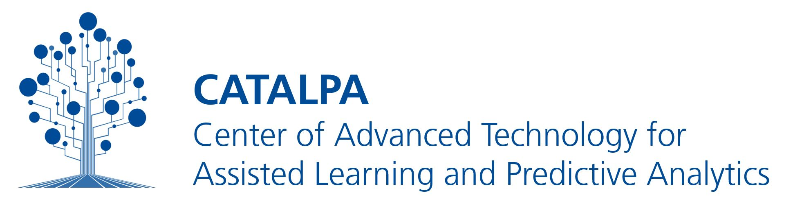

# SERIAL 3 - SElf Regulation induced by Adaptive Learning, version 3

SERIAL 3 is a Learning Analytics Dashboard for Moodle. It offers a set of widgets that teachers can enable for their courses. Students then select, arrange, and configure the widgets that are most relevant to them, creating a personalized dashboard.

**Features**

- Customizable widget-based dashboard system
- Implemented widgets
  - **Progress Chart:** Visualizes individual course activities (e.g. quizzes, assignments, self-assessments, longpages) as colored squares arranged in a row per course unit. The color indicates the student's self-reported level of understanding. Clicking a square opens a popover where the student can rate how well they understand the associated learning material. The popover also provides a direct link to the course activity and a button to add it to the task list.
  - **Learner Goals and Indicators:** Displays bullet charts that track progress toward a student's chosen learning goal (overview, passing, mastery, or practice) across five indicators from the learner model: knowledge gain, competency, assessment results, time management, and social interaction. Different color tones represent the performance ranges of poor, average, and above average.
  - **Feedback:** Delivers adaptive feedback to support self-regulated learning strategies. Feedback scenarios are defined through adaptation rules using an additional Moodle plugin called the Adaptation Rule Interface (ARI).
  - **Task List:** Allows students to plan individual goals and tasks with optional due dates. Completed tasks can be ticked off and archived.
  - **Deadlines:** Aggregates due dates from the task list and appointments from the Moodle course calendar into a single view.
  - **Quiz Statistics:** Reference implementation demonstrating how assessment results can be visualized. Still work in progress.
  - **Course Overview:** Provides a simplified overview of course activities per section, including reflection prompts.
  - **Learning Strategies:** Offers information about learning strategies related to self-regulation. Students can bookmark strategies, and individual strategies can be referenced from other widgets or parts of the course.
  - **Teacher Activity:** Work-in-progress widget showing teacher activity within the course, including forum posts, pending corrections, and updated material.

**Roadmap**

- Finnishing UI
- Submit as an official Moodle plugin
- Integrate the Moodle AI Provider as a service for widgets

# Installation

1. Go to `/your-moodle/course/format/` and run: `git clone https://github.com/CATALPAresearch/format_serial3.git serial3`
2. Open the page https://<moodle>/admin/index.php?cache=1 and follow the install instructions for the plugin.
3. Open a course of you choice and go to the _course settings_. Set the 'course
   format' to 'SERIAL 3'.

```bash
# push code to test system
rsync -r ./* aple.moodle.staging.fernuni-hagen.de:/var/moodle/htdocs/moodle/course/format/serial3 --exclude={'.env','node_modules','*.git','.DS_Store','.gitignore','.vscode'}

```

# Development

- run `npm install` to install all dependencies
- change to folder `vue` and run in terminal `npm run build` to transpile changes from in vue to js

**Dependencies**

- Moodle v4.5 or newer
- vue.js v3, vuex v4
- d3.js
- vue-grid-layout library (https://jbaysolutions.github.io/vue-grid-layout/)

## Testing

```bash
cd /path/to/moodle
php admin/tool/phpunit/cli/init.php
# Run all tests (72)
find course/format/serial3/tests -name '*_test.php' -exec vendor/bin/phpunit {} \;
# Or run specific test file
vendor/bin/phpunit course/format/serial3/tests/webservices_test.php
```

## Getting Started

**Key files:**

- `ws/*.php` - Webservice implementations (strict naming conventions required)
- `db/services.php` - Webservice definitions referencing ws classes
- `vue/` - Vue.js application source (transpiles to `amd/`)
- `version.php` - Increment when changing services.php

**Widget development:**
Widgets are elements containing data visualisiations or learning support instruments that can be arranged together in a dashboard.  
Teachers can enable/disable dashboard widgets via a modal interface (slider icon in MenuBar). From the set of enables widgets students can choose which widgets they want to see at certain position on the dashboard.

See how to add a widget to the dashboard [readme-widget-setup.md](readme-widget-setup.md)

**Moodle compliance:** See [readme-moodle-compliance.md](readme-moodle-compliance.md)

## Credits

This software uses the following open source packages:
[vue.js](https://vuejs.org/),
[vuex](https://vuex.vuejs.org/),
[vue-router](https://router.vuejs.org/),

## Related Moodle Plugins

- tba

## Citation

**Cite this software:**

```bibtex
@misc{Seidel2024-MoodleSerial3,
  title = {{{SERIAL3}} - {{A}} Course Format Plugin Supporting Adaptive Self-Regulated Learning in {{Moodle}}},
  author = {Seidel, Niels and Meyer, Valerie},
  date = {2024},
  doi = {10.17605/OSF.IO/9TKPS},
  url = {https://github.com/CATALPAresearch/format_serial3}
}
```

## Research articles and datasets about Longpage

**Peer-reviewed papers**

- Seidel, N., Meyer, V., & Radović, S. (2024). Co-Design of an Adaptive Personalized Learner Dashboard. IEEE International Conference on Advanced Learning Technologies (ICALT), 26–28. https://doi.org/10.1109/ICALT61570.2024.00014
- Seidel, N. (2025). Architecture for Gradually AI-teamed Adaptation Rules in Learning Management Systems. Proceedings of the 17th International Conference on Computer Supported Education - Volume 1: CSEDU, 243–254. https://doi.org/10.5220/0013215800003932
- Radović, S., & Seidel, N. (2024). Self-regulated learning support in technology enhanced learning environments: A reliability analysis of the SRL-S Rubric. Journal of Assessment Tools in Education, 11(4), 675–698. https://doi.org/10.21449/ijate.1502786
- Radović, S., Seidel, N., Menze, D., & Kasakowskij, R. (2024). Investigating the effects of different levels of students’ regulation support on learning process and outcome: In search of the optimal level of support for self-regulated learning. Computers & Education, 215(105041). https://doi.org/10.1016/j.compedu.2024.105041
- Seidel, N., Karolyi, H., Burchart, M., & de Witt, C. (2021). Approaching Adaptive Support for Self-regulated Learning. In D. Guralnick, M. E. Auer, & A. Poce (Eds), Innovations in Learning and Technology for the Workplace and Higher Education. TLIC 2021. Lecture Notes in Networks and Systems (pp. 409–424). Springer International Publishing. https://doi.org/10.1007/978-3-030-90677-1_39

## You may also like ...

- [mod_longpage](https//github.com/catalparesearch/mod_longpage) - Supporting reading of long texts.
- [mod_usenet](https//github.com/catalparesearch/mod_usenet) - Usenet client for Moodle
- [local_ari](https//github.com/catalparesearch/local_ari) - Adaptation Rule Interface
- [mod_openchat](https://github.com/nise/mod_openchat) - LLM and agent chat plugin

## Contributors

- Niels Seidel (project lead)
- Valerie Meyer
- Slavisa Radovic
- Marc Burchart

## Licence

[GNU GPL v3 or later](http://www.gnu.org/copyleft/gpl.html)

---

<a href="https://www.fernuni-hagen.de/english/research/clusters/catalpa/"></a>
<a href="https://www.fernuni-hagen.de/"></a>
